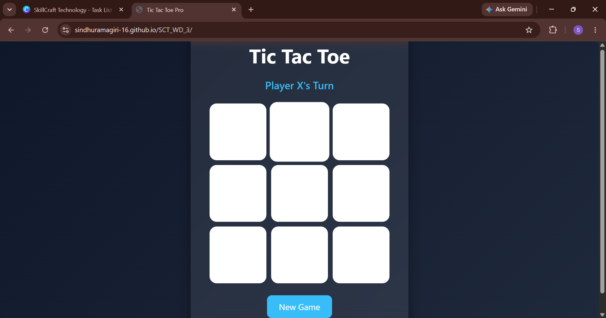
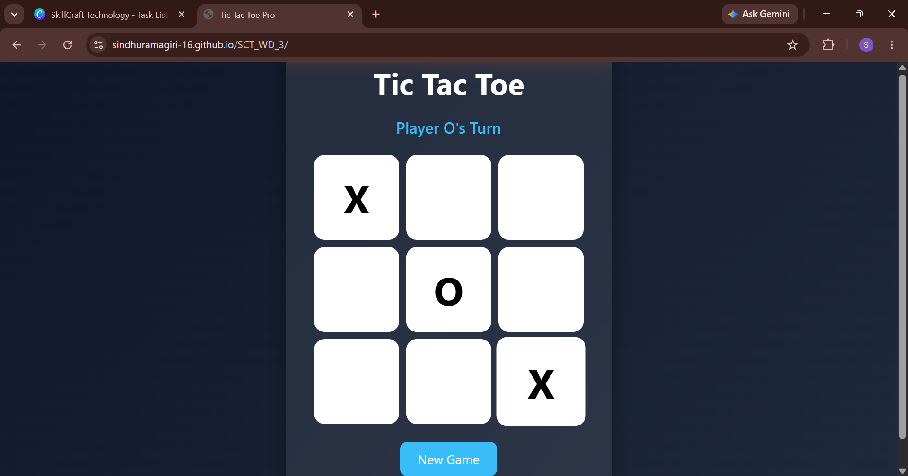
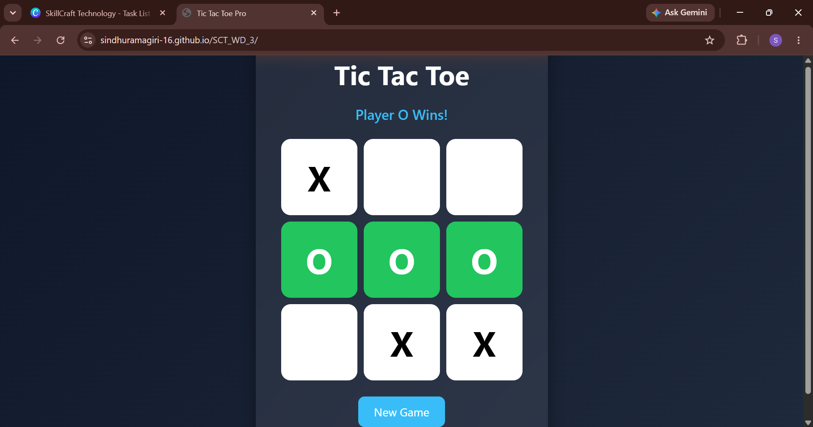

# SCT_WD_3 - Tic Tac Toe Web Application

## 📌 Project Overview

This project is a Tic-Tac-Toe Web Application developed as part of the SkillCraft Technology Web Development Internship.

The game allows two players to compete on a 3×3 grid while automatically checking winning conditions and game status.

---

## 🚀 Features

- Interactive Tic-Tac-Toe Board
- Two Player Mode
- Winner Detection
- Draw Detection
- Restart Game Option
- Responsive Design
- Modern User Interface

---

## 🛠 Technologies Used

- HTML5
- CSS3
- JavaScript

---

## 📂 Project Structure

SCT_WD_3/
│
├── index.html
├── style.css
├── script.js
├── README.md
└── screenshots/
    ├── home.png
    ├── playing.png
    └── result.png

---

## 📸 Screenshots

## ▶ How to Run

1. Download or Clone the Repository.
2. Open the project folder in VS Code.
3. Open index.html using Live Server.
4. Start playing Tic-Tac-Toe.

---

## 🎯 Learning Outcomes

- DOM Manipulation
- Event Handling
- Game Logic Development
- JavaScript Fundamentals
- Git & GitHub Workflow

---

